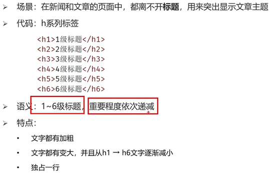
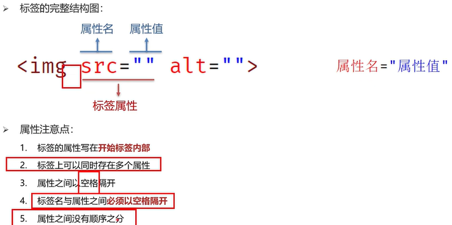
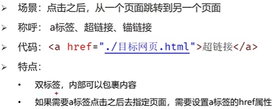
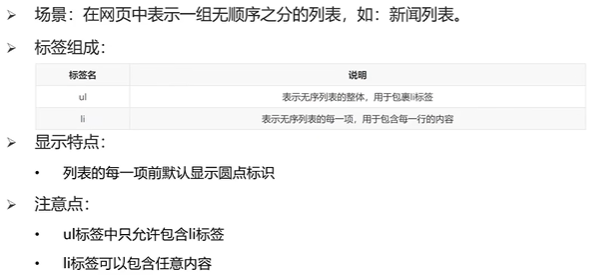
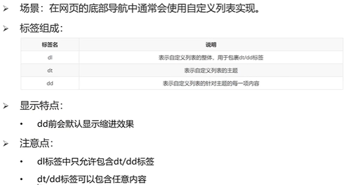
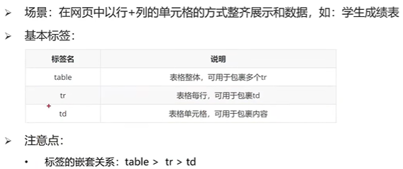

# MarkDown使用教程

## 一、换行
1 行尾两个空格  
2 HTML的\ 标签   
## 二、强调
### 1、加粗  
加粗文本，请在单词或短语的前后各添加**两个**星号或下划线  
加粗一个单词或短语的中间部分用以表示强调的话，加粗部分的两侧各添加两个星号  
### 2、斜体
斜体显示文本，在单词或短语前后添加 *一个* 星号或下划线  
斜体突出单词的中间部分，字母前后各添加一个星号，中间不要带空格
### 3、粗体和斜体
在单词或短语的前后各添加三个星号或下划线  
突出单词的中间部分，字母前后各添加三个星号，中间不要带空格

# HTML
注释快捷键 ctrl+/  
同时选择相同内容的快捷键 ctrl+d  

## 一、标签 
### 1、标题标签

### 2、段落标签

### 3、换行标签
\   
### 4、水平线标签
\

### 5、文本格式化标签

### 6、图片标签

图片标签的属性  
alt:替换文本  
title：鼠标悬停时显示的文本  
width/height：图片的高度和高度，只输入一个属性时另一个等比例缩放  
### 7、音频标签audio

### 8、视频标签
在google浏览器中，可以实现视频的静音自动播放  

### 9、链接标签
  

### 10、列表标签
#### （1）无序列表

#### （2）有序列表
与无序列表的区别只在于ol  

#### （3）自定义列表

### 11、表格标签
  
表格相关属性  
