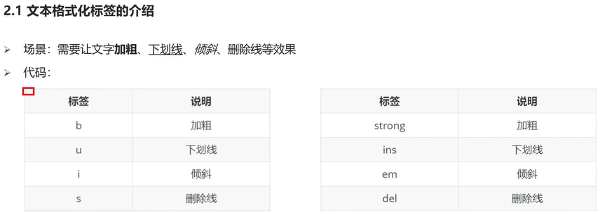

# MarkDown使用教程
## 换行
1 行尾两个空格  
2 HTML的\ 标签   
## 强调
### 加粗  
加粗文本，请在单词或短语的前后各添加**两个**星号或下划线  
加粗一个单词或短语的中间部分用以表示强调的话，加粗部分的两侧各添加两个星号  
### 斜体
斜体显示文本，在单词或短语前后添加 *一个* 星号或下划线  
斜体突出单词的中间部分，字母前后各添加一个星号，中间不要带空格
### 粗体和斜体
在单词或短语的前后各添加三个星号或下划线  
突出单词的中间部分，字母前后各添加三个星号，中间不要带空格

# HTML
注释快捷键 ctrl+/  
同时选择相同内容的快捷键 ctrl+d  
## 标签 
### 标题标签

### 段落标签

### 换行标签
\   
### 水平线标签
\

### 文本格式化标签

### 图片标签

图片标签的属性  
alt:替换文本  
title：鼠标悬停时显示的文本  
width/height：图片的高度和高度，只输入一个属性时另一个等比例缩放  
返回上级目录 ../