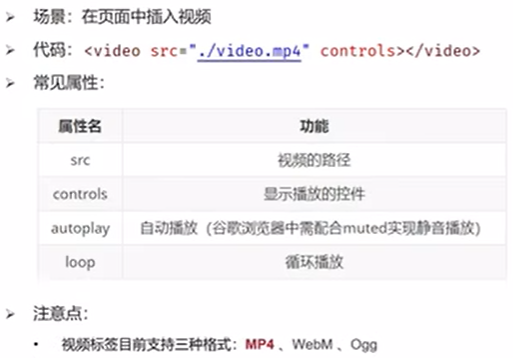
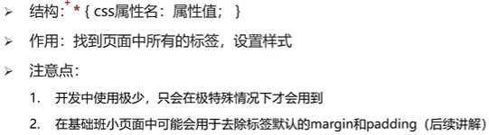

# MarkDown使用教程
## 一、换行
1 行尾两个空格  
2 HTML的\ 标签   
## 二、强调
### 1、加粗  
加粗文本，请在单词或短语的前后各添加**两个**星号或下划线  
加粗一个单词或短语的中间部分用以表示强调的话，加粗部分的两侧各添加两个星号  
### 2、斜体
斜体显示文本，在单词或短语前后添加 *一个* 星号或下划线  
斜体突出单词的中间部分，字母前后各添加一个星号，中间不要带空格
### 3、粗体和斜体
在单词或短语的前后各添加三个星号或下划线  
突出单词的中间部分，字母前后各添加三个星号，中间不要带空格

# HTML Hyper Text Markup Language
注释快捷键 ctrl+/    
同时选择相同内容的快捷键 ctrl+d  
复制黏贴的快捷键shift+alt+下  
如果想要加入多个空格，空格的字符实体为nbsp;

## 一、标题标签

## 二、段落标签

## 三、换行标签
\   
## 四、水平线标签
\

## 五、文本格式化标签

## 六、图片标签

图片标签的属性  
alt:替换文本  
title：鼠标悬停时显示的文本  
width/height：图片的高度和高度，只输入一个属性时另一个等比例缩放  
## 七、音频标签audio

## 八、视频标签
在google浏览器中，可以实现视频的静音自动播放  

## 九、链接标签
  

## 十、列表标签
### 1、无序列表

### 2、有序列表
与无序列表的区别只在于ol  

### 3、自定义列表

## 十一、表格标签
### 1、基本标签
  
### 2、表格相关属性  
  
### 3、表格标题和表头单元格标签  
    caption的位置与tr标签位置平行
    th标签用于替换td标签
  
### 4、表格的结构标签  
作用:增强代码可读性与执行速度  

### 5、合并单元格

## 十二、表单标签
### 1、input系列标签
     
text/password占位符：用于显示提示信息，属性值为placeholder  
radio单选框：单选功能：两个input中使用相同的name属性 默认选中：在input标签添加checked  
file上传多个文件：在input内添加multiple  
按钮 reset按钮需要配合表单域标签form作为其父级标签一起使用

### 2、button按钮标签

### 3、select下拉菜单标签

### 4、textarea文本域标签

### 5、label标签

## 十三、语义化标签
### 1、无语义的布局标签div span

### 2、有语义的布局标签（了解，移动端常用）

# CSS Cascading Style Sheets
在css中，大小的单位是px（pixel），即像素  
## 一、基础认识
css的引入方式，css能写在哪  

## 二、基础选择器
### 1、标签选择器

### 2、类选择器
类选择器的定义在style里用点开头，使用在标签内添加class属性，此时不加点

### 3、id选择器
配合js使用  

### 4、通配符选择器

## 三、字体和文本样式
### 1、字体样式
#### (1)字体大小

#### (2)字体粗细

#### (3)字体样式(是否倾斜)

#### (4)字体类型
  
如果给同一标签的相同属性设置了不同的值，此时样式会覆盖，写在最下面的样式会生效
#### (5)font属性连写

### 2、文本样式
#### (1)文本缩进：text-indent
取值：数字+px，数字+em（em表示当前标签font-size的大小）
#### (2)文本水平对齐方式：text-align

#### (3)文本修饰：text-decoration

### 3、line-height行高