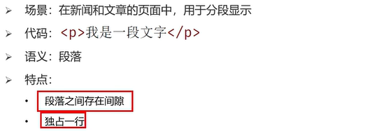
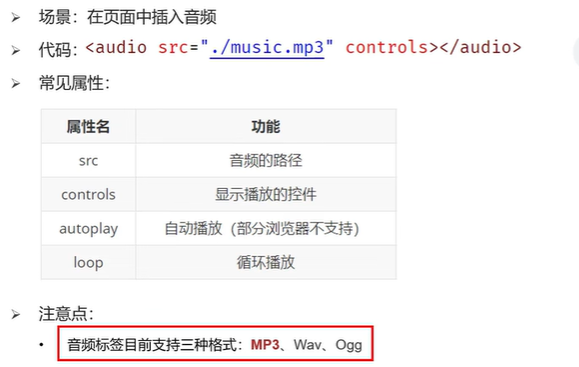
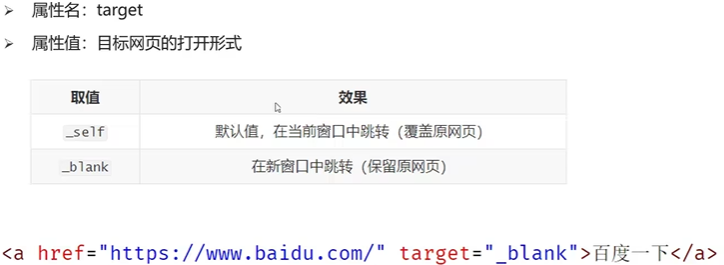
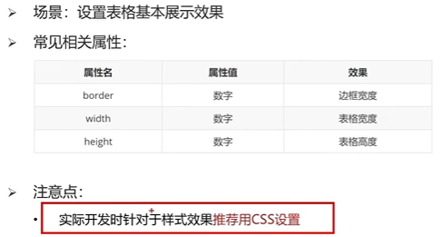
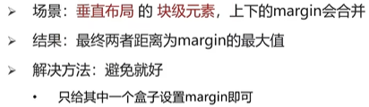

# 快捷键
注释快捷键 ctrl+/    
同时选择相同内容的快捷键 ctrl+d  
复制黏贴的快捷键shift+alt+下  
 macOS中，qq截屏快捷键为control+command+A
如果想要加入多个空格，空格的字符实体为nbsp;
# MarkDown使用教程
## 一、换行
1 行尾两个空格  
2 HTML的\ 标签   
## 二、强调
### 1、加粗  
加粗文本，请在单词或短语的前后各添加**两个**星号或下划线  
加粗一个单词或短语的中间部分用以表示强调的话，加粗部分的两侧各添加两个星号  
### 2、斜体
斜体显示文本，在单词或短语前后添加 *一个* 星号或下划线  
斜体突出单词的中间部分，字母前后各添加一个星号，中间不要带空格
### 3、粗体和斜体
在单词或短语的前后各添加三个星号或下划线  
突出单词的中间部分，字母前后各添加三个星号，中间不要带空格

# HTML Hyper Text Markup Language
## 一、标题标签

## 二、段落标签

## 三、换行标签
\   
## 四、水平线标签
\

## 五、文本格式化标签

## 六、图片标签

图片标签的属性  
alt:替换文本  
title：鼠标悬停时显示的文本  
width/height：图片的高度和高度，只输入一个属性时另一个等比例缩放  
## 七、音频标签audio

## 八、视频标签
在google浏览器中，可以实现视频的静音自动播放  

## 九、链接标签
  

## 十、列表标签
### 1、无序列表

### 2、有序列表
与无序列表的区别只在于ol  

### 3、自定义列表

## 十一、表格标签
### 1、基本标签
  
### 2、表格相关属性  
  
### 3、表格标题和表头单元格标签  
    caption的位置与tr标签位置平行
    th标签用于替换td标签
  
### 4、表格的结构标签  
作用:增强代码可读性与执行速度  

### 5、合并单元格

## 十二、表单标签
### 1、input系列标签
     
text/password占位符：用于显示提示信息，属性值为placeholder  
radio单选框：单选功能：两个input中使用相同的name属性 默认选中：在input标签添加checked  
file上传多个文件：在input内添加multiple  
按钮 reset按钮需要配合表单域标签form作为其父级标签一起使用

### 2、button按钮标签

### 3、select下拉菜单标签

### 4、textarea文本域标签

### 5、label标签

## 十三、语义化标签
### 1、无语义的布局标签div span

### 2、有语义的布局标签（了解，移动端常用）

# CSS
Cascading Style Sheets  
在css中，大小的单位是px（pixel），即像素  
选多行加相同内容alt+shift+鼠标左键单击
## 一、基础认识
css的引入方式，css能写在哪  

## 二、基础选择器
### 1、标签选择器

### 2、类选择器
类选择器的定义在style里用点开头，使用在标签内添加class属性，此时不加点

### 3、id选择器
配合js使用  

### 4、通配符选择器

## 三、字体和文本样式
### 1、字体样式
#### (1)字体大小

#### (2)字体粗细

#### (3)字体样式(是否倾斜)

#### (4)字体类型
  
如果给同一标签的相同属性设置了不同的值，此时样式会覆盖，写在最下面的样式会生效
#### (5)font属性连写

### 2、文本样式
#### (1)文本缩进：text-indent
取值：数字+px，数字+em（em表示当前标签font-size的大小）
#### (2)文本水平对齐方式：text-align

#### (3)文本修饰：text-decoration

### 3、line-height行高

### 4、常见颜色取值
background-color指的是标签背景颜色  
color指的是标签内部内容的颜色

### 5、扩展-标签水平居中的写法
在标签内添加 margin:0 auto
## 四、选择器进阶
选择器的目的就是为了找标签
### 1、复合选择器
#### (1)后代选择器

#### (2)子代选择器
相对于后代选择器，空格变为大于号，此时只会选择前者标签的子代  

### 2、并集选择器

### 3、交集选择器
两标签连写，中间不加任何东西  
两标签选择器不能构成交集选择器  

### 4、hover伪类选择器
任何一个标签都可以被鼠标悬停，因此任何一个选择器都可以添加伪类选择器  

### 5、Emmet语法
作用：通过简写语法，快速生成代码
## 五、背景相关属性
### 1、背景颜色

### 2、背景图片

### 3、背景平铺

### 4、背景位置
背景色和背景图只显示在盒子的里面  

### 5、背景相关属性连写

## 六、元素显示模式
### 1、块级元素
以div为例   

### 2、行内元素
以span为例  

### 3、行内块元素  
以img为例,一行显示多个，可以调节宽高  

### 4、元素显示模式转换  

### 5、嵌套规范注意点
记住不可相互嵌套的几组即可，如果强行嵌套，浏览器会自动将嵌套关系转变为同级关系  

## 七、CSS特性
### 1、继承性
控制文字属性的都可以继承  
a的color会继承失效，h系列的font-size会继承失效  

### 2、层叠性

### 3、优先级
#### (1)优先级的介绍
!important的书写位置: color:pink !important;  
!important一般不写在父级标签中  

#### (2)权重叠加计算
出现复合选择器计算优先级

## 八、盒子模型
一般设计顺序:从外到内,先宽高背景色,放内容,调节内容位置,控制位置细节  
### 1、盒子模型的介绍

### 2、内容区域的宽度和高度

### 3、边框border
border会撑大盒子的尺寸
solid实线 dashed虚线 dotted点线  
  
边框单方向设置left right top bottom  
  

### 4、内边距padding
内边距是一个多值参数,顺序为上、右、下、左,如果参数的数量不足四个,则会参考对面  
内减模式代码:box-sizing:border-box  

### 5、外边距margin
与内边距padding的设置完全相同  
### 6、一些问题
#### (1)清除默认内外边距
   
#### (2)版心居中
 即将盒子置于浏览器中间,代码为margin:0 auto 左右边距记为auto   
#### (3)去掉列表的圆点符号
list-style: none;  
#### (5)合并现象  

#### (6)塌陷现象

#### (7)行内元素的内外边距问题
如果想要通过margin或padding改变行内标签的垂直位置，无法生效  
行内标签的margin-top和bottom不生效  
行内标签的padding-top或botttom不生效  
解决方案:设置行内元素的行高  
## 九、结构伪类选择器
  

## 十、伪元素
多用于装饰性的图片  
